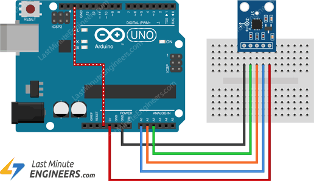

# Arduino Measurements
This repository aims to set up an Arduino environment to carry out several simultaneous force and acceleration measurements.
The data will then be postprocessed with Python and stored locally.

## 1. Hardware setup
### 1.1 Force sensors
Initially, two load modules of 10kg and 20kg each have been used for testing and configuration purposes. Each set comes with the load cell itself, and also an HX-711 amplifier module, which provides the measured values in a readable scale for Arduino.

The connections between the different components have been carried out as follows:

*Source: Indrek(YouTube)*
*Source: [circuitjournal.com](https://circuitjournal.com/four-wire-load-cell-with-HX711#arduino-code)*

The pins have been soldered to the HX-711 amplifier module to make easier but solid connections with the wires.

### 1.2 Accelerometers

As well as with the HX-711 amplifier modules, the pins have been soldered to the accelerometers.

*Source: lastminuteengineers.com*

## 2. Arduino software setup
The base code that was used and later adapted (`Read_2x_load_cell.ino`) was obtained from [Olav Kallhovd (GitHub)](https://github.com/olkal/HX711_ADC). 

Apart from reading, processing and filtering the measurements, the package also features an option to tare the measuring equipment. Also, running the `Calibrate.ino` file generates a calibration value which can then be used in the main code.

#### Measurements

#### Transmission over Serial port

Every set of simultaneous measurements are transmitted in a single line, separated by commas (','). 

## 3. Python postprocessing
The operations detailed below have been implemented in the following file: `Postprocessing` / `serial_connection`

The Python 'serial' module enables to read the incoming data over the Serial port. 

Each new set of measurements must first be decoded, separated into individual values and turned into 'float' variables. Then, they are stored as a list and they can be used to perform the desired operations.

Also, a variable of interest would be the frequency at which new data are obtained.

