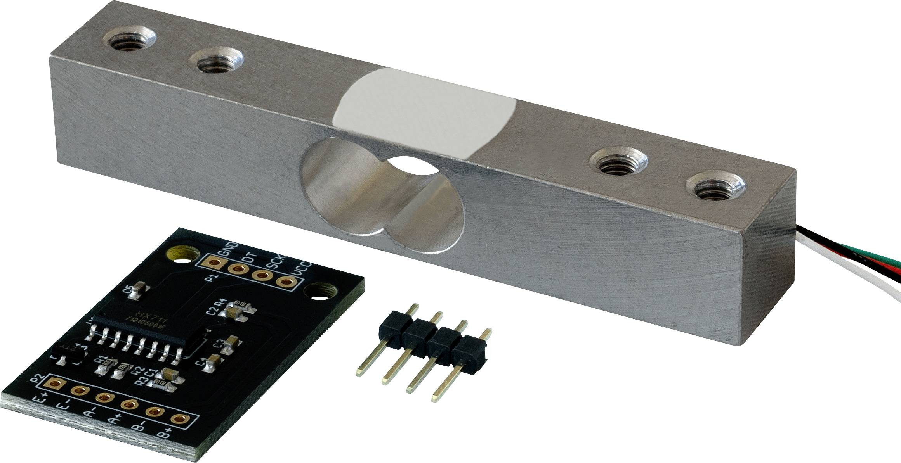

# Arduino Measurements
This repository aims to set up an Arduino environment to carry out several simultaneous force and acceleration measurements.
The data will then be postprocessed with Python and stored locally.

## 1. Hardware setup
### 1.1 Force sensors
Initially, two load modules of 10kg and 20kg each have been used for testing and configuration purposes. Each set comes with the load cell itself, and also an ADXL345 amplifier module, which provides the measured values in a readable scale for Arduino.

The connections between the different components have been carried out as follows:

*Source: [circuitjournal.com](https://circuitjournal.com/four-wire-load-cell-with-HX711#arduino-code)*

A+ and A- wires can be interchanged, since this would only affect the sign of the output value. DT and SCK pins have to be connected to digital pins on the Arduino board.

The pins have been soldered to the ADXL345 amplifier module to make easier but solid connections with the wires. A more detailed description of the mounting process can be found in the following [YouTube video](https://youtu.be/sxzoAGf1kOo?si=58I9zBAtfJAC0C_C).

### 1.2 Accelerometers

Apart from a 5V power supply, each accelerometer requires connection with 3 analogue pins. No amplifier module is needed in this case.

*Source: lastminuteengineers.com*

As well as with the ADXL345 amplifier modules, the pins have been soldered to the accelerometers.

### 1.3 Final setup

Some pictures of the actual hardware setup are presented below.

## 2. Arduino software setup
The code that was loaded on the Arduino board (`Read_load_accelerometer.ino`) has been constructed based on two independent pieces of code:
- The base code for the load cells (`Read_1x_load_cell.ino`) was obtained from [Olav Kallhovd (GitHub)](https://github.com/olkal/HX711_ADC). Apart from reading, processing and filtering the measurements, the package also features an option to tare the measuring equipment. Also, running the `Calibrate.ino` file generates a calibration value which can then be used in the main code.
- The base code for the accelerometers (`Read_accelerometer.ino`) was obtained from [LastMinuteEngineers](https://lastminuteengineers.com/adxl335-accelerometer-arduino-tutorial/). The main feature is the use of a function (`int ReadAxis()`) that performs 10 independent measurements and averages them before providing a value.

#### Measurements
The board has been programmed according to the following sequence:

- First, it waits until new measurement data from the load cells are available.
- Then, if enough time has passed since the last serial print, the measurement process of the accelerometers is triggered.
- Once the acceleration data are available, they are postprocessed and translated into acceleration in G's.

Every set of measurements will be composed of one value per load cell and three values for every accelerometer.

#### Transmission over Serial port

Every set of simultaneous measurements are transmitted in a single line, separated by commas (','). 

## 3. Postprocessing and measurement assessment

Although a Python tool has been developed for postprocessing (in particular to calculate the sampling frequency), the same operations can be carried out within the Arduino C++ code and are pushed through the Serial port.

The following monitors have been implemented:

- **Timer**. This variable represents the average time spent per measurement, obtained as a previous step for calculating the frequency.
- **Frequency**. This is one of the most relevant parameters, since the hardware should serve for a modal analysis, among other.
- **Timer2**. It helps determine how much time each process takes up and where the biggest delay takes place.
- **'Times checked'**. This has helped ensure, for instance, that a certain condition is contiuously being checked by the Arduino code.

In order not to overload the Serial output, one can select through the `n` variable every how often the mentioned parameters are shown. 

## 4. Results and conclusions

- When making **force and acceleration measurements simultaneously**, the best measurement frequency that could be achieved lies between 11.10 and 11.20 Hz. The biggest bottleneck to improve it was the force sensor equipment. It seems that the amplifier module follows a digital protocol and it takes around 80 ms to have new data ready. So it is most probably an internal issue of the amplifier module. The process has been nevertheless streamlined as much as possible.
- On the contrary, the **acceleration measurement** is straightforward and provides much higher rates when used independently (up to 1020 to 1030 Hz, if the values are directly used and not pre-filtered).
- **Baud rate** has no or little impact on the frequency, so a standard value of 57600 has been used. 
- The "method" of **logging** the values to a .csv file is not relevant either in terms of sampling frequency. Therefore, the code was set to log every 10 measurements received so as to relieve the memory requirements.

Taking into account the purpose of the project, the accelerometers can be used as they are, since they have proved to be fast and accurate enough.
As for the force sensor, it does not seem to provide big enough sampling frequencies and alternative should be then considered.
